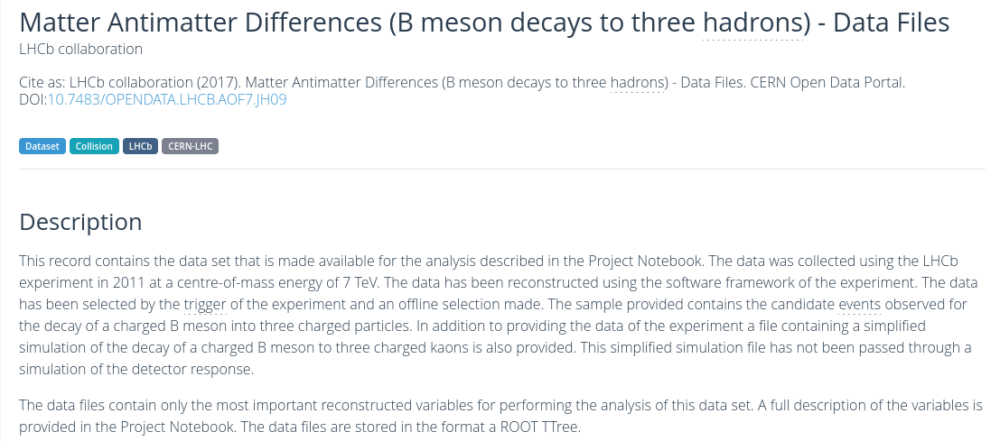
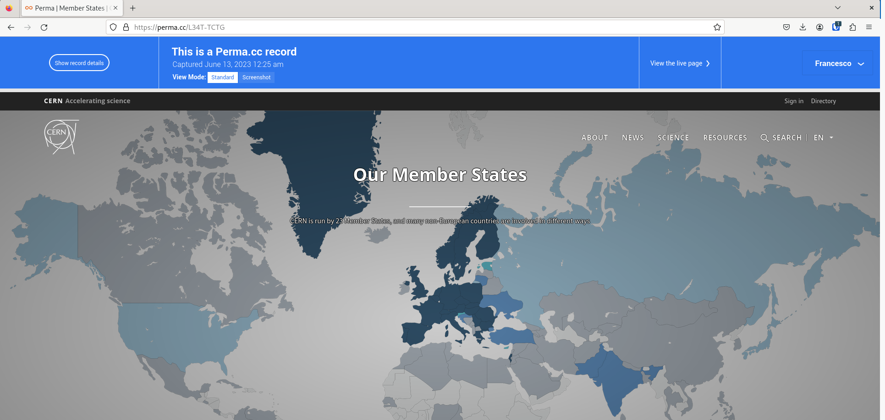
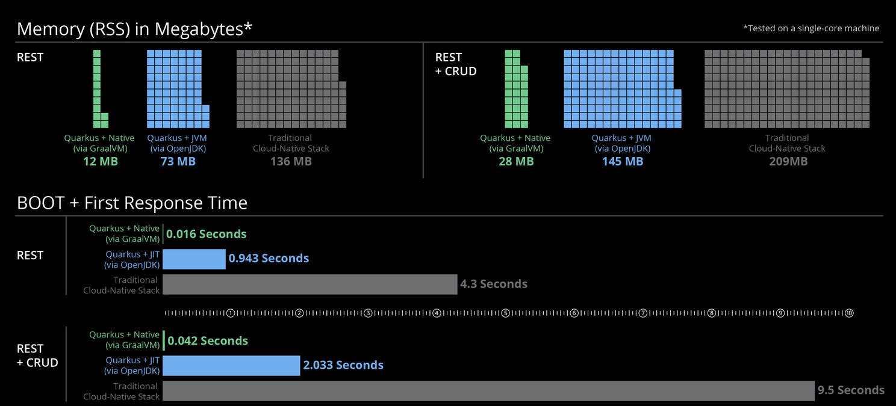

## Plan

- [ ] Data
  - [x] ID
  - [x] Vocabulary
  - [ ] Data lifecycle
  - [x] Logical data
  - [x] Physical data
  - [ ] Conversion
- [ ] REST endpoints
- [x] Code structure
- [x] Implementation
  - [x] Whys
    - [ ] MongoDB
- [x] Deployment
- [ ] FAIR principles

---

# Open data server

https://github.com/fandreuz/open-data-server

---

## Motivation

- Generic, flexible and extensible framework to parse, augment and store open source datasets
- Scalable
- Implementation provided for [CERN Open Data Portal](https://opendata.cern.ch/)

---

# Vocabulary

---

### Collection

A set of datasets related to the same topic/experiment/event.

### Dataset

A table of heterogeneous data (CSV, JSON, ROOT).

---

## Example (collection)



---

## Example (dataset)


---

# Conceptual data model

---

- We want a scalable model w.r.t. number/structure of datasets stored
  - One table (collection) per dataset
- All dataset metadata entities together, in a separate table (`dataset-metadata`)
- Metadata common to the whole collection stay in a separate table (`collections-metadata`)

---


---

# Logical data model

---

## Dataset

Each table is the direct translation of the dataset to the DB model.

---

## Dataset metadata

```
"datasetId": Dataset ID
"fileName": Original name of the dataset file in the external repository
"type": CSV, ROOT, JSON, ...
"sizeInBytes": Size in bytes
"numberOfColumns": Number of columns in the dataset
"commaSeparatedColumnNames": Name of the columns in the dataset
"importTimestamp": Import time stamp
"collectionMetadata": Link to the metadata of the collection
   which contains this dataset
```

---

### Collection metadata

DataCite compulsory fields and some recommended

```
"id": ID of the collection
"name": Name of the collection in the external repository
"experimentName": Name of the experiment
"eventsCount": Name of the events of interest observed
"type": Simulation, measurement, ...
"keyword": Free keywords for the topic of the experiment
"tag": Free tags for the collection
"citeText": Text to cite the collection
"doi": DOI of the collection
"license": License attached to the collection
"creator": User who first imported the collection in the database
"title": Title of the collection
"publisher": Published entity of the collection
"publicationYear": Publication year
"language": Reference language of the collection
"subject": Longer text to describe the topic of the collection
"description": Long description
"geoLocation": Geographical coordinates where the collection was created         
"fundingReference": Reference to the funding                                      
```

---

# Physical data model

---

## Constraints

- Entity integrity constraint
- No other particular constraints on datasets tables
- Some important metadata fields should be non-blank (e.g. compulsory DataCite fields)
- Implementation-dependent

---

## Keys

- For each dataset ID there's one dataset metadata entry and one dataset table
- For each collection ID there may be one or more datasets

---

## Transactions

While importing a new dataset it's important that the `datasets-metadata` and the dataset table become "visible" at the same time.

---

## Extracting metadata

---

### Web-scraping (JSoup)

```java
   private String extractExperimentName(@NonNull Document document) {
      return document.getElementsByClass("badge-experiment").text().trim();
   }

   private String extractCollectionType(@NonNull Document document) {
      return document.getElementsByClass("badge-subtype").text().trim();
   }

   private String extractKeyword(@NonNull Document document) {
      return document.getElementsByClass("badge-keyword").text().trim();
   }

   private String extractCollectionTag(@NonNull Document document) {
      return document.getElementsByClass("badge-tag").text().trim();
   }
```

---

### Regular expressions

```java
private String extractLicense(@NonNull Document document) {
      String licenseText;
      try {
         licenseText = document.getElementsMatchingOwnText("Disclaimer").first() // <h2>Disclaimer</h2>
               .parent() //
               .getElementsByTag("p") //
               .text() //
               .trim();
      } catch (Exception exception) {
         return "";
      }
      Matcher matcher = LICENSE_PATTERN.matcher(licenseText);
      if (matcher.find()) {
         return matcher.group(1);
      }
      return "";
   }
```

---

### Augmenting metadata

Some of the fields above may need customized per-implementation values.

E.g. for CERN Open Data Portal:
- `fundingReference`
- `geoLocation`
- `subject`

---

### Example: Funding reference (permalink)



---

# Unique identifiers

Uniform Resource Name (URN) standard: `schema:namespace:resourceName`

---

### Dataset ID

A dataset is identified by the schema, the namespace name (i.e. the collection it belongs to) and the file name.

### Example

We identify the file `experimentData` in the collection `19090` with the following URN:

```
cern-open-data:19090:experimentData
```

---

### Collection ID

A dataset is identified by the schema and its name. The last part of the URN is omitted since it's not needed.

### Example

We identify the collection `19090` with the following URN:

`cern-open-data:19090`

---

# Data format

---

### Communication with user over HTTP protocol

**JSON**

- De-facto standard for RESTful APIs
- Better integration with the tooling
- More pleasant to write manually (e.g. cURL)

```json
{
  "collectionId": "13128",
  "fileName": "237040910_EventInfo.csv"
}
```

---

### Intermediate representation of datasets

**CSV**

- Easy to visualize
- Easy to parse

```csv
posX,posZ,driftDist
68.25,766.73,1.53
60.94,755.39,0.99
65.14,755.39,1.56
67.24,759.03,0.77
66.15,763.09,0.81
52.89,956.74,0.62
57.09,956.74,1.57
...
```

---

# REST endpoints

Full list in `README.md`

---

### `PUT /v1`

Idempotent creation of a new dataset in the database.

Example request body:

```json
{
  "collectionId": "13128",
  "fileName": "237040910_EventInfo.csv"
}
```

Sample interaction:

```
curl --header "Content-Type: application/json" \
  --request PUT \
  --data '{"collectionId":"13128","fileName":"237040910_EventInfo.csv"}' \
  http://localhost:8080/v1
```

---

Sample output:

```json
{
  "datasetId": "cern-open-data:13128:237040910_EventInfo",
  "fileName": "237040910_EventInfo.csv",
  "type": "CSV",
  "sizeInBytes": 52,
  "numberOfColumns": 3,
  "commaSeparatedColumnNames": "evID,timestamp,muMom",
  "importTimestamp": 1686615824740,
  "collectionMetadata": {
    {
      "id": "cern-open-data:13128",
      "name": "13128",
      "experimentName": "OPERA",
      "eventsCount": 1,
      "type": "Derived",
      "keyword": "",
      "tag": "CERN-SPS",
      "citeText": "Cite as: OPERA collaboration (2019). OPERA neutrino-induced charmed hadron event 237040910. CERN Open Data Portal. ",
      "doi": "10.7483/OPENDATA.OPERA.Q74R.SYBQ",
      "license": "Creative Commons CC0 waiver",
      "creator": "curl/7.76.1",
      "title": "OPERA neutrino-induced charmed hadron event 237040910",
      "publisher": "OPERA",
      "publicationYear": 2019,
      "language": "English",
      "subject": "High Energy Physics, Theoretical Physics",
      "description": "This OPERA detector event is a muon neutrino interaction with the lead target where a charmed hadron was 
        reconstructed in the final state. The event data consist of Electronic Detector files (such as Drift Tube, RPC, 
        and Target Tracker files) and Emulsion Detector files (such as Tracks and Vertex files). For more information, 
        see the description of the whole dataset.",
      "geoLocation": "46.233832398 6.053166454",
      "fundingReference": "https://perma.cc/L34T-TCTG"
    }
  }
}
```

---

### `GET /v1/{id}/{column-name}`

Get the content of a column for the selected dataset.

Sample interaction:

```
curl -i --request GET \  
    http://localhost:8080/v1/cern-open-data:13128:237040910_EventInfo/posX
```

Sample output:

```json
{
  "647fa76f10c98516828586ae": "66.55",
  "647fa76f10c98516828586af": "64.45",
   ...
}
```

---

# High level design choices

---

### Authentication

- Authentication-less service
- No use-case for now (does not matter who imports what)
- Can be implemented later if needed

---

### Why CR~~UD~~

- Individual datasets are not usually updated or removed from CERN Open Data
- New datasets in a collection can be imported later
- Delete $=>$ Authentication

---

# Abstract code structure

---


---

## Tools for the implementation

- Java
- MongoDB
- Docker
- Quarkus
- Gradle

Full list in `README.md`

---

## Why Java

- Out-of-the-box static typing
- More natural OOP wrt alternaties
- Tooling

---

### Why MongoDB

TODO

---

### Why Docker

De-facto standard for containerization of applications

---

### Why Gradle

De-facto standard build-tool for Java applications

---

### Why Quarkus

- _Hot_ alternative to Spring Boot
- Supports compilation to native executable
  - Faster start-up time wrt JVM-based applications
- Claims to be more _Kubernetes-ready_ wrt competitors
  - Tooling for containerization
  - No need to deploy a full JVM in the container
- Out-of-the-box ORM integration with MongoDB

---

### Quarkus benchmarks



Source: https://quarkus.io/

---

### Native executable

```bash
[fandreuz@pc-342 root-data-server]$ sudo ./gradlew build \
    -Dquarkus.package.type=native \
    -Dquarkus.native.container-build=true \
    -Dquarkus.native.container-runtime=podman
[1/7] Initializing...                                                                                   (13.3s @ 0.28GB)
 Version info: 'GraalVM 22.3.2.1-Final Java 17 Mandrel Distribution'
 Java version info: '17.0.7+7'
 C compiler: gcc (redhat, x86_64, 8.5.0)
 Garbage collector: Serial GC
 3 user-specific feature(s)
 - io.quarkus.hibernate.validator.runtime.DisableLoggingFeature: Disables INFO logging during the analysis phase for the [org.hibernate.validator.internal.util.Version] categories
 - io.quarkus.runner.Feature: Auto-generated class by Quarkus from the existing extensions
 - io.quarkus.runtime.graal.DisableLoggingFeature: Disables INFO logging during the analysis phase
 [2/7] Performing analysis...  [*******]                                                                 (85.2s @ 2.70GB)
  14,872 (89.39%) of 16,638 classes reachable
  20,771 (60.57%) of 34,295 fields reachable
  73,401 (57.50%) of 127,659 methods reachable
     583 classes,   187 fields, and 3,055 methods registered for reflection
      63 classes,    68 fields, and    55 methods registered for JNI access
       4 native libraries: dl, pthread, rt, z
[3/7] Building universe...                                                                              (12.1s @ 2.13GB)
[4/7] Parsing methods...      [***]                                                                      (9.9s @ 3.26GB)
[5/7] Inlining methods...     [***]                                                                      (6.9s @ 2.05GB)
[6/7] Compiling methods...    [*********]                                                               (83.6s @ 1.19GB)
[7/7] Creating image...                                                                                  (6.8s @ 3.40GB)
  26.74MB (49.02%) for code area:    47,104 compilation units
  27.48MB (50.37%) for image heap:  353,319 objects and 16 resources
 339.15KB ( 0.61%) for other data
  54.55MB in total
------------------------------------------------------------------------------------------------------------------------
Top 10 packages in code area:                               Top 10 object types in image heap:
   1.63MB sun.security.ssl                                     6.01MB byte[] for code metadata
   1.02MB java.util                                            3.52MB java.lang.Class
 745.45KB java.lang.invoke                                     3.30MB java.lang.String
 717.67KB com.sun.crypto.provider                              2.83MB byte[] for general heap data
 526.25KB java.lang                                            2.71MB byte[] for java.lang.String
 493.69KB com.mongodb.internal.connection                      1.25MB com.oracle.svm.core.hub.DynamicHubCompanion
 450.58KB sun.security.x509                                  776.12KB byte[] for reflection metadata
 430.22KB io.quarkus.runtime.generated                       764.77KB java.util.HashMap$Node
 421.85KB java.util.concurrent                               691.95KB java.lang.String[]
 404.22KB io.netty.buffer                                    526.02KB c.o.svm.core.hub.DynamicHub$ReflectionMetadata
  19.65MB for 632 more packages                                4.87MB for 3782 more object types
                        9.1s (4.0% of total time) in 39 GCs | Peak RSS: 5.67GB | CPU load: 6.50
Produced artifacts:
 /project/root-data-server-1.0.0-SNAPSHOT-runner (executable)
 /project/root-data-server-1.0.0-SNAPSHOT-runner-build-output-stats.json (json)
 /project/root-data-server-1.0.0-SNAPSHOT-runner-timing-stats.json (raw)
 /project/root-data-server-1.0.0-SNAPSHOT-runner.build_artifacts.txt (txt)
```

---

# Deployment

---

### Server Dockerfile

```Docker
# Build native executable
FROM quay.io/quarkus/ubi-quarkus-mandrel-builder-image:22.3-java17 AS build
USER root
RUN microdnf install findutils
COPY --chown=quarkus:quarkus gradlew /code/gradlew
COPY --chown=quarkus:quarkus gradle /code/gradle
COPY --chown=quarkus:quarkus build.gradle.kts /code/
COPY --chown=quarkus:quarkus settings.gradle.kts /code/
COPY --chown=quarkus:quarkus gradle.properties /code/
USER quarkus
WORKDIR /code
COPY src /code/src
RUN ./gradlew build -Dquarkus.package.type=native

# Go executables to deal with .root files
FROM golang:1.20 AS go-root
RUN go install go-hep.org/x/hep/cmd/root2csv@latest && cp $GOPATH/bin/root2csv /usr/local/bin/
RUN go install go-hep.org/x/hep/groot/cmd/root-ls@latest && cp $GOPATH/bin/root-ls /usr/local/bin/

# Create docker image
FROM quay.io/quarkus/quarkus-micro-image:2.0
WORKDIR /work
COPY --from=build /code/build/*-runner /work/runner
COPY --from=go-root /usr/local/bin/root2csv /work/go/bin/
COPY --from=go-root /usr/local/bin/root-ls /work/go/bin/
RUN chmod 775 /work
EXPOSE 8080
CMD ["./runner", "-Dquarkus.http.host=0.0.0.0", "-Droot.executables.path=/work/go/bin"]
```

---

### Docker compose

The full application is bundled as a `docker-compose.yml` file:
```yml
services:
  server:
    build: .
    ports:
      - "8080:8080"
    environment:
      - mongodb.uri=mongodb://mongo:27017
  mongo:
    image: "mongo:latest"
    ports:
      - "27017"
```

---

# Thanks for your attention